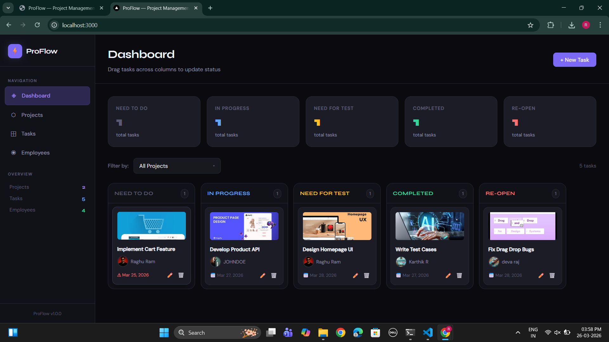
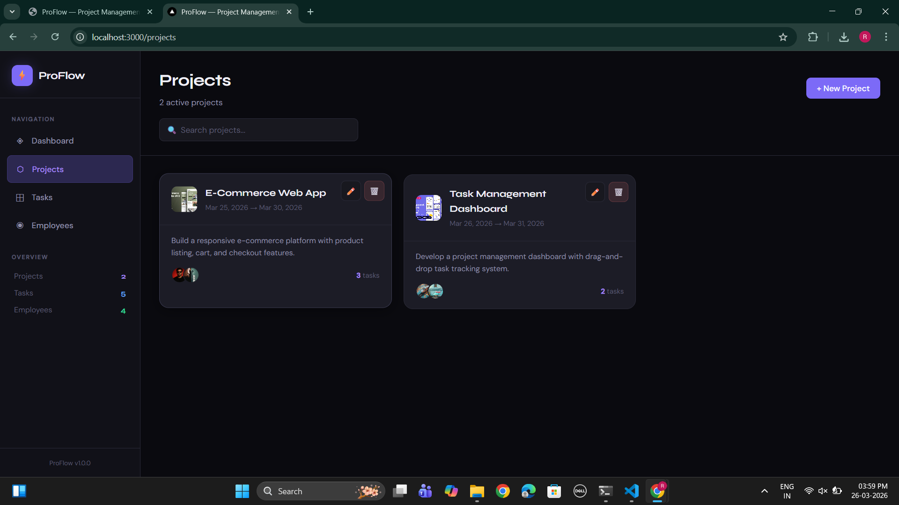
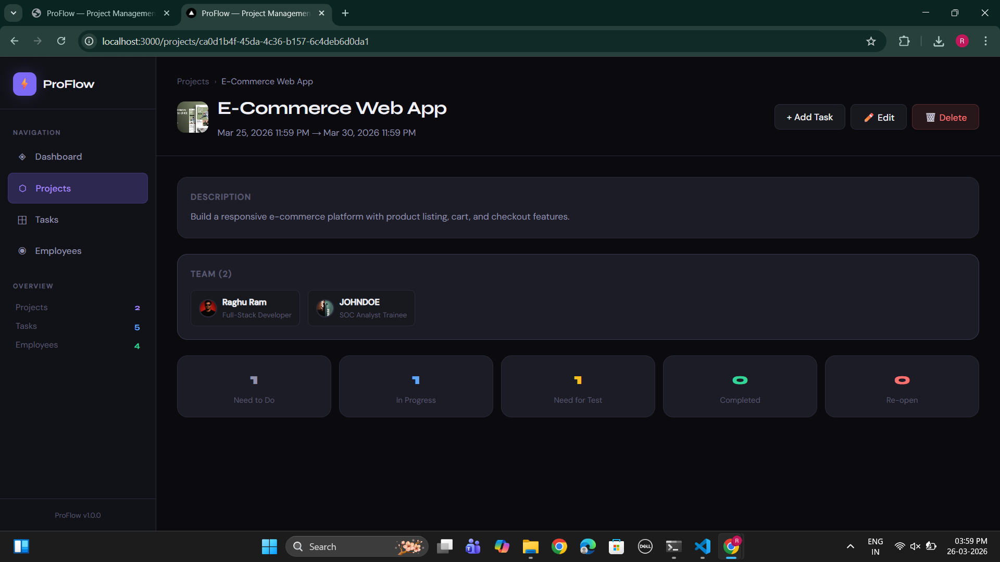
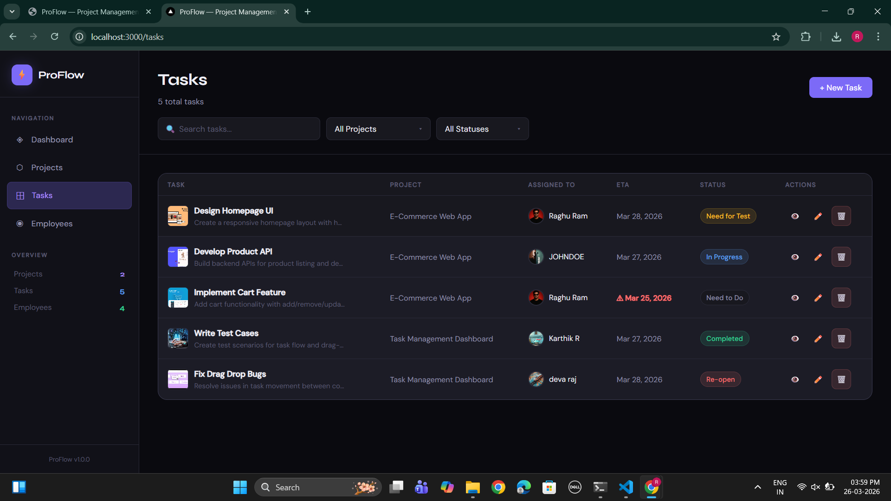
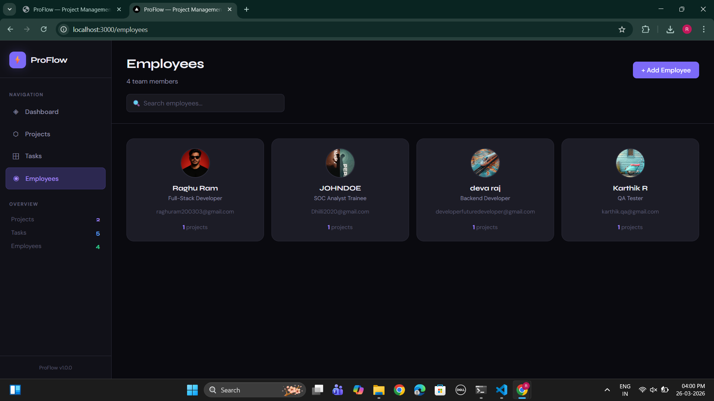

# ProFlow — Project Management Dashboard


> A full-featured Project Management Dashboard built with React, Redux Toolkit, and drag-and-drop support. Manage employees, projects, and tasks with a beautiful Kanban board interface.

---

## 📌 Table of Contents

- [Features](#-features)
- [Tech Stack](#-tech-stack)
- [Project Structure](#-project-structure)
- [Setup & Installation](#-setup--installation)
- [How to Use](#-how-to-use)
- [Validation Rules](#-validation-rules)
- [Design System](#-design-system)
- [Screenshots](#-screenshots)
- [Live Demo](#-live-demo)
- [Author](#-author)

---

## 🚀 Features

### 👥 Employee Management
- Add, edit, view, delete employees
- Profile photo upload (base64)
- Unique email validation
- Search employees by name, email, or position

### 📁 Project Management
- Full CRUD with project logo upload
- Start & end date/time picker
- Assign multiple employees to a project
- Project detail view with team and task summary
- Search projects by title or description

### ✅ Task Management
- Tasks linked to existing projects only
- Assign tasks to project-assigned employees only
- Multiple reference image uploads
- View, edit, delete tasks
- Filter by project and status

### 📋 Kanban Dashboard
- 5 columns: **Need to Do**, **In Progress**, **Need for Test**, **Completed**, **Re-open**
- Drag-and-drop tasks between columns
- Filter tasks by project via dropdown
- Task cards show title, assigned employee, ETA, and image
- Overdue ETA highlighted in red

### 🔔 Other
- Toast notifications for all CRUD operations
- Persistent state via localStorage
- Fully responsive layout
- Empty states for all pages

---

## 🛠 Tech Stack

| Layer | Technology |
|---|---|
| Framework | React 18 (Functional Components + Hooks) |
| Routing | React Router DOM v6 |
| State Management | Redux Toolkit |
| Forms | React Hook Form + Yup |
| Drag & Drop | @dnd-kit/core + @dnd-kit/sortable |
| Styling | Custom CSS with CSS Variables |
| Build Tool | Vite |
| Persistence | localStorage |

---

## 📁 Project Structure

```
src/
├── components/
│   ├── common/
│   │   ├── Avatar.jsx          # Reusable avatar with initials fallback
│   │   ├── ConfirmDialog.jsx   # Reusable delete confirmation modal
│   │   ├── ImageUpload.jsx     # Drag & drop image upload component
│   │   ├── Modal.jsx           # Reusable modal wrapper
│   │   ├── Sidebar.jsx         # Navigation sidebar with live counts
│   │   └── ToastContainer.jsx  # Toast notification system
│   ├── dashboard/
│   │   └── DashboardBoard.jsx  # Kanban board with drag-and-drop
│   ├── employees/
│   │   ├── EmployeeForm.jsx    # Add/edit employee modal form
│   │   └── EmployeesPage.jsx   # Employee list with CRUD
│   ├── projects/
│   │   ├── ProjectDetail.jsx   # Project detail page
│   │   ├── ProjectForm.jsx     # Add/edit project modal form
│   │   └── ProjectsPage.jsx    # Projects list with CRUD
│   └── tasks/
│       ├── TaskForm.jsx        # Add/edit task modal form
│       └── TasksPage.jsx       # Tasks table with CRUD
├── store/
│   ├── index.js                # Redux store + localStorage persistence
│   └── slices/
│       ├── employeesSlice.js   # Employees state management
│       ├── projectsSlice.js    # Projects state management
│       ├── tasksSlice.js       # Tasks state + COLUMNS config
│       └── uiSlice.js          # Toast + sidebar UI state
├── utils/
│   ├── helpers.js              # formatDate, toBase64, getInitials, isEtaOverdue
│   └── validation.js           # Yup schemas for all forms
├── App.jsx                     # Router + App layout
└── index.css                   # Global design system + CSS variables
```

---

## 📦 Setup & Installation

### Prerequisites
- Node.js v16+
- npm or yarn

### Steps

```bash
# 1. Clone the repository
git clone https://github.com/raghuram-007/project-management-dashboard.git

# 2. Navigate into the project
cd project-management-dashboard

# 3. Install dependencies
npm install

# 4. Start the development server
npm run dev

# 5. Open in browser
# http://localhost:5173
```

### Build for Production

```bash
npm run build
```

---

## 🎯 How to Use

### Step 1 — Add Employees
> Go to **Employees** → click **+ Add Employee**
- Fill in name, position, official email
- Upload a profile photo
- Click **Add Employee**

### Step 2 — Create a Project
> Go to **Projects** → click **+ New Project**
- Fill in project title, description
- Set start & end date/time
- Upload a project logo (optional)
- Assign at least one employee
- Click **Create Project**

> ⚠️ You must add employees before creating a project.

### Step 3 — Create Tasks
> Go to **Tasks** or **Dashboard** → click **+ New Task**
- Select a project
- Only employees assigned to that project will appear
- Set ETA and upload reference images (optional)
- Click **Create Task**

### Step 4 — Use the Kanban Board
> Go to **Dashboard**
- Drag task cards between columns to update status
- Use the project dropdown to filter tasks
- Overdue tasks are highlighted in red ⚠️

---

## ✅ Validation Rules

| Rule | Details |
|---|---|
| All fields required | Name, position, email, image for employees |
| Valid email | Must be proper email format |
| Unique email | No two employees can share the same email |
| Date range | Project end date must be after start date |
| Employee assignment | At least one employee must be assigned to a project |
| Task employee | Only project-assigned employees selectable for tasks |

---

## 🎨 Design System

- **Theme** — Dark with purple accent (`#7c6af7`)
- **Display Font** — Syne (headings & numbers)
- **Body Font** — DM Sans (UI text)
- **CSS Variables** — Consistent theming across all components
- **Responsive** — Works on desktop, tablet, and mobile

---

---

## 📸 Screenshots

> *(Add screenshots or a screen-recorded GIF here before submission)*

| Page | Preview |
|---|---|
| Dashboard (Kanban) |  |
| Projects List |  |
| Project Detail |  |
| Tasks Table |  |
| Employees Page |  |

---

## 🌐 Live Demo

> Live Link: https://project-management-dashboard-teal.vercel.app/

---

## 👨‍💻 Author

**Raghuram**
- GitHub: [@raghuram-007](https://github.com/raghuram-007)

---

